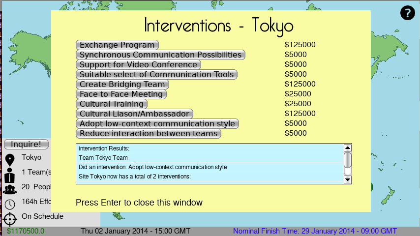
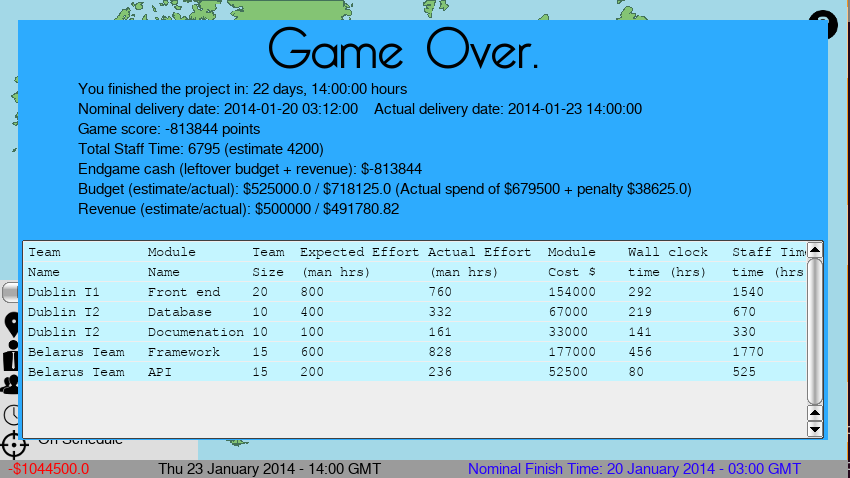

As part of the final year of our B.A. (Mod) Degrees, We had to design a software engineering simulation game.
We formed a team under the name "Team Crab", and our project went on to be graded highest.

